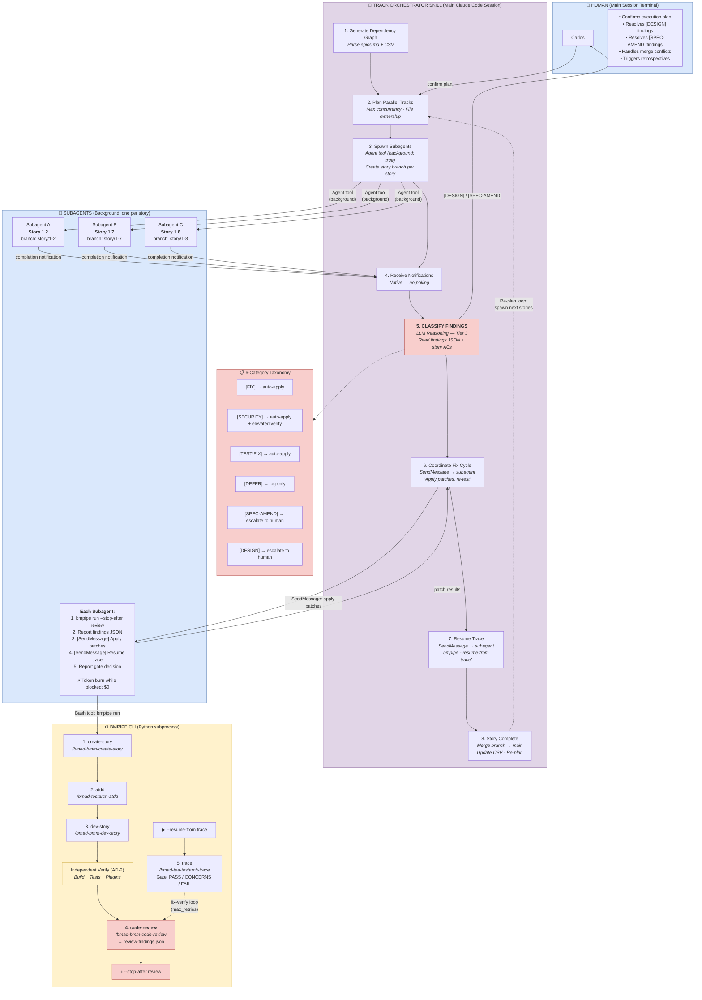
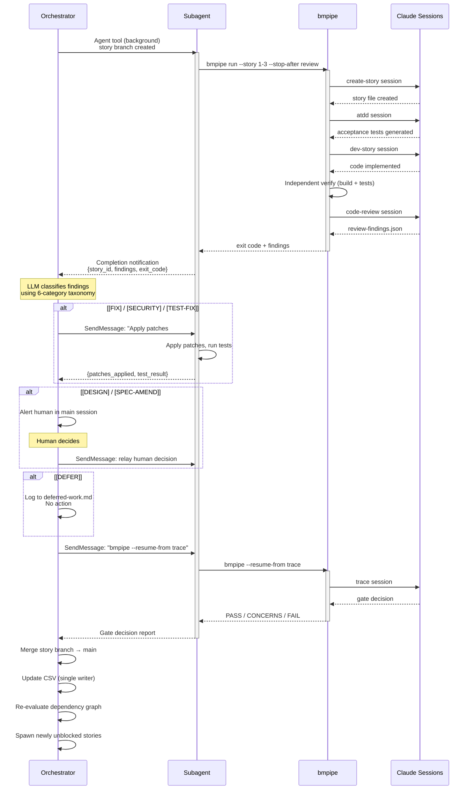
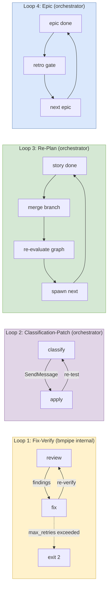

# BMAD SDLC Automation Architecture

## System Overview

## Subagent Lifecycle (Per Story)

## System Loops

## Token Cost Model

| Component | Per Story | % of Total |
|-----------|----------|------------|
| **bmpipe workflows** (5 Claude sessions) | ~50-200K tokens | 80-95% |
| **Orchestrator** (planning, classification, coordination) | ~10-20K tokens | 5-15% |
| **Subagent** (spawn, report, patches, trace report) | ~6-13K tokens | 3-5% |
| **Subagent idle time** (blocked on bmpipe Bash call) | **$0** | 0% |
| **Total** | **~66-233K tokens** | 100% |

## Infrastructure

| Component | Required? | Notes |
|-----------|-----------|-------|
| Claude Code CLI | ✅ Yes | bmpipe wraps it |
| Python 3.11+ | ✅ Yes | bmpipe runtime |
| BMAD Method | ✅ Yes | Skills invoked by each pipeline step |
| `helpers/state.py` | ✅ Yes | Dependency graph, CSV updates |
| ~~tmux~~ | ❌ Removed | Subagents replace it |
| ~~Sentinel files~~ | ❌ Removed | Native notifications replace them |
| ~~Polling loops~~ | ❌ Removed | Event-driven via Claude Code |

## Exit Codes (bmpipe)

| Code | Meaning | Orchestrator Action |
|------|---------|-------------------|
| 0 | Success | Mark done, merge, re-plan |
| 1 | Workflow failure | Alert human, mark blocked |
| 2 | Review max retries | Alert human |
| 3 | Human required | Present findings, wait for decision |
